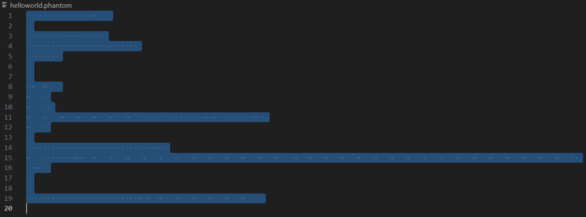

# [Brainfuck-interpreter](./brainfuck-interpreter.c)

A [Brainfuck](https://esolangs.org/wiki/Brainfuck) interpreter written in C. It supports **dynamic memory expansion**, allowing it to handle large and deeply nested Brainfuck programs. The interpreter reads Brainfuck code from files or standard input, making it versatile for various use cases.

## Features

* __Dynamic Memory Expansion:__ Automatically expands the memory array when needed, allowing for large programs.

* __Stack-Based Loop Handling:__ Efficiently manages nested loops using a custom stack implementation.

* __Multiple File Support:__ Accepts multiple Brainfuck files as input and interprets each sequentially.

* __Interactive Mode:__ Reads Brainfuck code from standard input if no files are provided.


# [Brainfuck-compiler](./brainfuck-compiler.c)

A Brainfuck compiler written in C. It supports **dynamic memory expansion** and generates C code from Brainfuck source files, and then compiles it with the `cc` compiler via a pipeline. Additionally, the compiler can read Brainfuck code from stdin and output C code to stdout when no source files are provided.

Note: The compiled executable can only read from stdin and output to stdout.

## Process

1. Brainfuck source files
2. C code
3. Pipeline
4. `cc` compiler
5. Executable

## Features

* __Compiles Brainfuck to C:__ Generates C code from Brainfuck source files.
* __Support for Dynamic Memory:__ Handles dynamic memory requirements for large Brainfuck programs.
* __Pipeline Compilation:__ The generated C code is directly passed to a C compiler using a pipeline, allowing for seamless compilation into executables.
* __Standard Input Support:__ When no source files are chosen, the compiler reads Brainfuck code from stdin and outputs the corresponding C code to stdout.

# Brainfuck-generator([tbf.bf](./my-bf-programs/tbf.bf))

A generator, written in Brainfuck, converts normal text to Brainfuck code. It can be directly run using the `Brainfuck-interpreter` or compiled with the `Brainfuck-compiler`.

## Idea

1.Make an arithmetic sequence: a(0)=0 a(1)=1 ^^^ a(255)=255 a(256)=256=0

2.Use `<` or `>` to position the pointer according to the relative displacement between the new input char and the old input char

3.Use `.` to putchar

## Examples

See [README.bf](./LICENSE.bf)

```
$ echo hello
hello

$ echo hello | ./tbf.exe
>+[[->+>+<<]>+>[-<<+>>]<]
<[<]
>>>>>>>>>>>>>>>>>>>>>>>>>>>>>>>>>>>>>>>>>>>>>>>>>>>>>>>>>>>>>>>>>>>>>>>>>>>>>>>>>>>>>>>>>>>>>>>>>>>>>>>>.<<<.>>>>>>>..>>>.<<<<<<<<<<<<<<<<<<<<<<<<<<<<<<<<<<<<<<<<<<<<<<<<<<<<<<<<<<<<<<<<<<<<<<<<<<<<<<<<<<<<<<<<<<<<<<<<<<<<<.<<<<<<<<<<.

$ echo hello | ./tbf.exe | ./bf
hello
```
```
$ echo hello | ./bf ./tbf.bf
>+[[->+>+<<]>+>[-<<+>>]<]
<[<]
>>>>>>>>>>>>>>>>>>>>>>>>>>>>>>>>>>>>>>>>>>>>>>>>>>>>>>>>>>>>>>>>>>>>>>>>>>>>>>>>>>>>>>>>>>>>>>>>>>>>>>>>.<<<.>>>>>>>..>>>.<<<<<<<<<<<<<<<<<<<<<<<<<<<<<<<<<<<<<<<<<<<<<<<<<<<<<<<<<<<<<<<<<<<<<<<<<<<<<<<<<<<<<<<<<<<<<<<<<<<<<.<<<<<<<<<<.
```

# [Ook!](https://esolangs.org/wiki/Ook!) Translator ([bf2ook.bf](./my-bf-programs/bf2ook.bf) and [ook2bf.bf](./my-bf-programs/ook2bf.bf))

A translator, written in Brainfuck, converts Brainfuck code to Ook! code and vice versa. It can be directly run using the `Brainfuck-interpreter` or compiled with the `Brainfuck-compiler`.

## Idea

Find key words and output the translation. (Easy in C, but hard in Brainfuck)
```
Ook!    ->      Brainfuck   ->      Ook!
.?              >                   Ook. Ook?
?.              <                   Ook? Ook.
..              +                   Ook. Ook.
!!              -                   Ook! Ook!
!.              .                   Ook! Ook.
.!              ,                   Ook. Ook!
!?              [                   Ook! Ook?
?!              ]                   Ook? Ook!
??              banana                                     
```

When writing Brainfuck code, it is useful to remember and reuse certain code blocks, combining them to create larger and more complex programs.

It is recommended to read ook2bf.bf first, followed by bf2ook.bf, and finally tbf.bf, in reverse order of their creation.

ook2bf.bf has a better design description and more detailed comments.

## Examples

See [LICENSE.ook](./LICENSE.ook)

```
$ echo "><+-.,[]" | ./bf2ook.exe
Ook. Ook? Ook? Ook. Ook. Ook. Ook! Ook! Ook! Ook. Ook. Ook! Ook! Ook? Ook? Ook!

$ echo "><+-.,[]" | ./bf2ook.exe | ./ook2bf.exe
><+-.,[]

$ echo "Ook. Ook? (Ook? Ook?) Ook? Ook. Ook. Ook. Ook! Ook! Ook! Ook. Ook. Ook! Ook! Ook? Ook? Ook!" | ./ook2bf.exe
>banana<+-.,[]
```

# [Blub](https://esolangs.org/wiki/Blub) translator ([bf2blub.bf](./my-bf-programs/bf2blub.bf) and [blub2bf.bf](./my-bf-programs/blub2bf.bf))

A translator between Brainfuck and Blub, written in Brainfuck, similar to the Ook! translator but for fish instead of orangutans. When encountering (Blub? Blub?), give the memory pointer some fishfood.


# Phantom

Phantom: An esoteric programming language designed by [moskensoap](https://github.com/moskensoap) on 8/7/2024. It is almost exactly like [Ook](https://esolangs.org/wiki/Ook!) and [Blub](https://esolangs.org/wiki/Blub), but changed into Phantom words, inspired by [Whitespace](https://esolangs.org/wiki/Whitespace).

## Commands

\[Space\], \[Tab\], and \[LF\] for Space (ASCII 32), Tab (ASCII 9), and Line Feed (ASCII 10).

| Brainfuck | Phantom            | Description                                 |
|-----------|--------------------|---------------------------------------------|
| >         | \[Space\]\[LF\]    | Move the pointer to the right               |
| <         | \[LF\]\[Space\]    | Move the pointer to the left                |
| +         | \[Space\]\[Space\] | Increment the memory cell under the pointer |
| -         | \[Tab\]\[Tab\]     | Decrement the memory cell under the pointer |
| .         | \[Tab\]\[Space\]   | Output the character signified by the cell at the pointer |
| ,         | \[Space\]\[Tab\]   | Input a character and store it in the cell at the pointer |
| [         | \[Tab\]\[LF\]      | Jump past the matching \[LF\]\[Tab\] if the cell under the pointer is 0 |
| ]         | \[LF\]\[Tab\]      | Jump back to the matching \[Tab\]\[LF\]     |
| n/a       | \[LF\]\[LF\]       | Give the memory pointer some whisper        |

## File extension(s)

`.phantom`, `.whisper`

## Phantom Translator ([bf2phantom](./my-bf-programs/bf2phantom.bf) and [phantom2bf](./my-bf-programs/phantom2bf.bf))

A translator between Brainfuck and Phantom, written in Brainfuck. When encountering (\[LF\]\[LF\]), give the memory pointer some whisper.

## Examples

See [LICENSE.phantom](./LICENSE.phantom)




# Installation
0. Dependencies
```
makedepends={'make','gcc'}
depends={'gcc'}
```
If compiling in MSYS2 **mingw-w64**, you can use `'${MINGW_PACKAGE_PREFIX}-cc'` instead of `'gcc'`.

1. Compile the Program
```
make
```
2. Move Executables to PATH

Move the following executables to a directory in your PATH:

* `bf`: Brainfuck Interpreter
* `bfc`: Brainfuck Compiler
* `tbf.exe`: Brainfuck Generator from normal text
* `bf2ook.exe`: Brainfuck to Ook! Translator
* `ook2bf.exe`: Ook! to Brainfuck Translator
* `bf2blub.exe`: Brainfuck to Blub Translator
* `blub2bf.exe`: Blub to Brainfuck Translator
* `bf2phantom.exe`: Brainfuck to Phantom Translator
* `phantom2bf.exe`: Phantom to Brainfuck Translator

3. Optional: Compile Brainfuck Code from Other Projects

To compile Brainfuck code from other projects using bfc, run:

```
make others
```

Then, move the new executables to a directory in your PATH.

* Brainfuck Generator: `2bf.exe`, `bfgen.exe`, `bf-code-generator.exe`
* Brainfuck Interpreter: `bf-by-adam-domurad-code-percent-input.exe`, `bf-by-clive-gifford-code-exclamation-point-input.exe`, `bf-by-daniel-b-cristofani-code-exclamation-point-input.exe`, `bf-by-frans-faase-code-exclamation-point-input.exe`, `bf-by-keymaker-code-exclamation-point-input.exe`, `bfbf.exe`
* Brainfuck to C Translator: `bf2c.exe`, `bf2c-awib.exe`
* game: `life.exe`

# Usage

## brainfuck-interpreter

To run the interpreter with one or more Brainfuck files:
```
bf file.bf
```
```
bf file1.bf file2.bf ...
```

To run the interpreter in interactive mode, providing Brainfuck code via standard input (Ctrl+z or Ctrl+d to input EOF):

```
bf
```

```
echo file.bf | bf
```

```
echo file.bf | bf > out.txt
```

## brainfuck-compiler

To get Brainfuck code from stdin and put C code to stdout
```
echo 'Hello World!' | tbf.exe | bfc
```
To compile one or more Brainfuck files:
```
bfc file.bf
```
```
bfc file1.bf file2.bf ...
```

# examples-from-others  
  
Collect from other GitHub repositories, websites, or Google search results, and show their URLs, README.md files, and LICENSE files if possible.


# Contributing

Contributions are welcome! Please fork the repository and submit pull requests with any improvements or bug fixes.